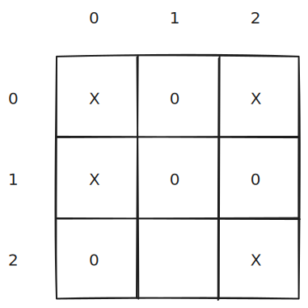
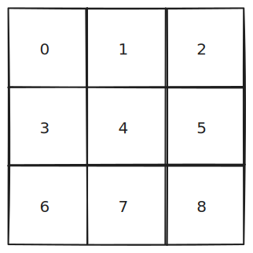
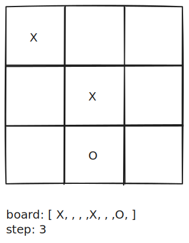
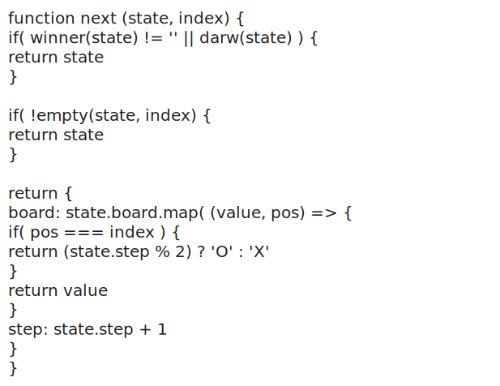
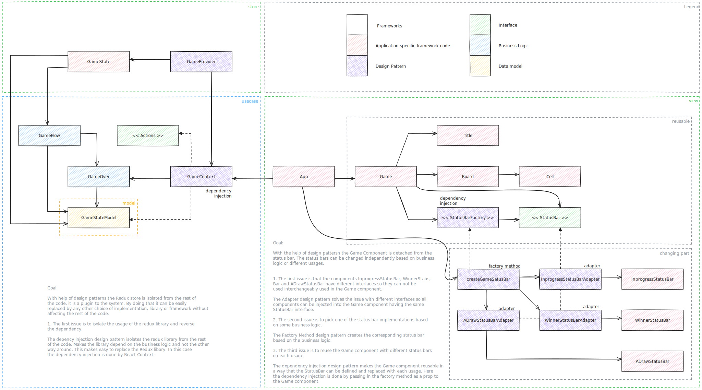

# Getting Started with Create React App

This project was bootstrapped with [Create React App](https://github.com/facebook/create-react-app), using the [Redux](https://redux.js.org/) and [Redux Toolkit](https://redux-toolkit.js.org/) TS template.

## Available Scripts

In the project directory, you can run:

### `npm start`

Runs the app in the development mode.\
Open [http://localhost:3000](http://localhost:3000) to view it in the browser.

The page will reload if you make edits.\
You will also see any lint errors in the console.

### `npm test`

Launches the test runner in the interactive watch mode.\
See the section about [running tests](https://facebook.github.io/create-react-app/docs/running-tests) for more information.

### `npm run build`

Builds the app for production to the `build` folder.\
It correctly bundles React in production mode and optimizes the build for the best performance.

The build is minified and the filenames include the hashes.\
Your app is ready to be deployed!

See the section about [deployment](https://facebook.github.io/create-react-app/docs/deployment) for more information.

### `npm run eject`

**Note: this is a one-way operation. Once you `eject`, you can’t go back!**

If you aren’t satisfied with the build tool and configuration choices, you can `eject` at any time. This command will remove the single build dependency from your project.

Instead, it will copy all the configuration files and the transitive dependencies (webpack, Babel, ESLint, etc) right into your project so you have full control over them. All of the commands except `eject` will still work, but they will point to the copied scripts so you can tweak them. At this point you’re on your own.

You don’t have to ever use `eject`. The curated feature set is suitable for small and middle deployments, and you shouldn’t feel obligated to use this feature. However we understand that this tool wouldn’t be useful if you couldn’t customize it when you are ready for it.

## What is the project abount

The project implemets the well known **TicTakToe** game. The special thing about the project that it uses plugin architecture. It is a (miniproject experiment) to implement using **plugin architecture**.

The **Tic-Tac-Toe** game has a 3 x 3 board.

### Rules of the game

- The Tic-Tac-Toe game is played by two users.
- In the game, players mark one after the other. Only one at a time.
- Each user puts its sign into an empty cell. The users are not allowed to mark a cell that is already contains a mark.
- The first user usually uses the `X` sign. The second the `O` sign.
- The user who manages to have three of its signs to be next to eachother on a horizontal, vertical or diagonal line wins the game.
- If all the cells are occupied and there is no winner then its a draw.

## Architecture

First thing to do to model the **state of the game**. We can observe that the cells can be enumerated and the coordinates can easely be calculated by their index (if it is needed at all).

We might also want to keep track of the current step. We know that the useres follow each other after each step therefore we can calculate the current user from the number of steps.

### The Model

### The Algorithm

Because it is a tiny project the algorithm can also be wirtten in pseudo code.

We can see that the algorithm could be formulated in a way that it takes in the current **state of the game**, an index and generates the next state of the game. So if a user puts a mark on the index passed in into the algorithm then the board will look like the one returned by the algorithm.

This reminds me of a reducer form Redux library. So I decided to use the **redux library**, but to conform to a **plugin architecture** the redux library has to be isolated which means that the rest of the code does not depend on the library. That will be more clear from the **UML like dependency diagram** in the following chapter.

The App component creates two instances of Game component to **showcase the reuse of Game component** with two differend status bars. This is an example of how to reuse a component where a part the component (this time the status bar) can be changed dynamically depending on business logic or the place of usage.

### Component Dependency Diagram

